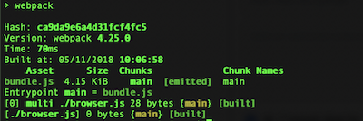
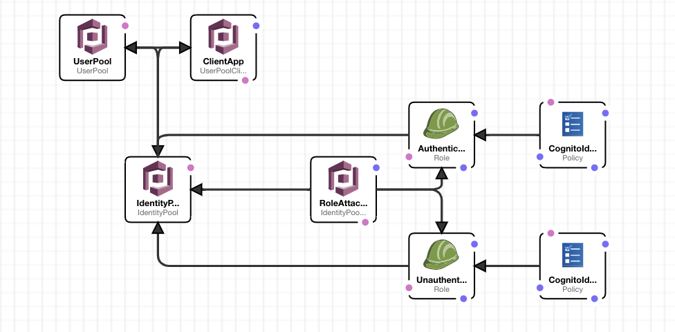

## Decouple Sign Up With Cognito
I've decided to start a new exercise. Let's presume we've already got a sign-up process in place, via an API or otherwise 
and we decide to start using Cognito to handle all registrations. If you're unfamilia with Cognito, you can do a fast read
on my previous article available [here](cognito_introduction.md){:target="_blank"}.

The exercise has two parts, one being the client written using Javascript and the other being the server, an architecture built with CloudFormation. I'm going to try to keep the client as clean as possible and if you haven't heard of CloudFormation, this is a simple way of building infrastructure inside AWS using a templating system written using YAML or JSON (more info [here](https://aws.amazon.com/cloudformation/){:target="_blank"}). 

### Prepare the client
Make sure you've got npm installed (https://www.npmjs.com/get-npm){:target="_blank"}, then go ahead and create a folder and inside it run:
```
# npm init && npm install --save aws-sdk && npm install --save-dev json-loader webpack webpack-cli 
```
Once that's finished, create a file called `webpack.config.js` in the root folder and populate it with this:
```javascript
// Import path for resolving file paths
var path = require('path');
module.exports = {
    // Specify the entry point for our app.
    entry: [
        path.join(__dirname, 'browser.js')
    ],
    // Specify the output file containing our bundled code
    output: {
        path: __dirname,
        filename: 'bundle.js'
    },
    module: {
        /**
         * Tell webpack how to load 'json' files.
         * When webpack encounters a 'require()' statement
         * where a 'json' file is being imported, it will use
         * the json-loader.
         */
        rules: [

        ]
    },
    mode: "development"
};
```
At this point, webpack will be configured, so we need to add it as a script inside package.json. Go ahead and add `"build": "webpack"` right after `"test"` script inside that file. The new package.json file should look like this:

```json
{
  "name": "decouple_sign_up_with_cognito",
  "version": "1.0.0",
  "description": "",
  "main": "index.js",
  "scripts": {
    "test": "echo \"Error: no test specified\" && exit 1",
    "build": "webpack"
  },
  "author": "",
  "license": "ISC",
  "dependencies": {
    "aws-sdk": "^2.348.0"
  },
  "devDependencies": {
    "json-loader": "^0.5.7",
    "webpack": "^4.25.0",
    "webpack-cli": "^3.1.2"
  }
}

```

We're almost there, we are going to use one js file to write our code, it's called `browser.js` and webpack needs to have it in order to compile the output js file that is going to be used by our `index.html` entry point. You can go ahead and create an empty file called `browser.js` and since we're at it, let's do the `index.html` too:
``` 
# touch browser.js && touch index.html 
```
Finally, let's test if everything works correctly by running:
```
# npm run build
```
You should see something like this:



### Prepare the Server
The server has two main parts. One User Pool with its attached Client App and one Federated Identity with two roles attached, one for unauthenticated users(guests) and one for authenticated users.

In theory we only need the first part for this exercise but it still worth showing how Federated Identities work and how can be used to authorize users to AWS services. 

The schema looks like this:



First, we need to build it. After you login into your AWS Console, go to CloudFormation Management Console in your chosen region, click `Create Stack`, then `Upload a template to Amazon S3` and upload the following template <a href="assets/download/decouple_sign_up_with_cognito.cloudformation" download>decouple_sign_up_with_cognito.cloudformation</a>.

Once the script has finished, go to `Cognito` and you'll see one User Pool called 'TestUserPool' and one Identity Pool called 'TestIdentityPool'. 

At this point, we have all we need to start writing code inside our app and use the underlying architecture to sign up and authenticate users. 
